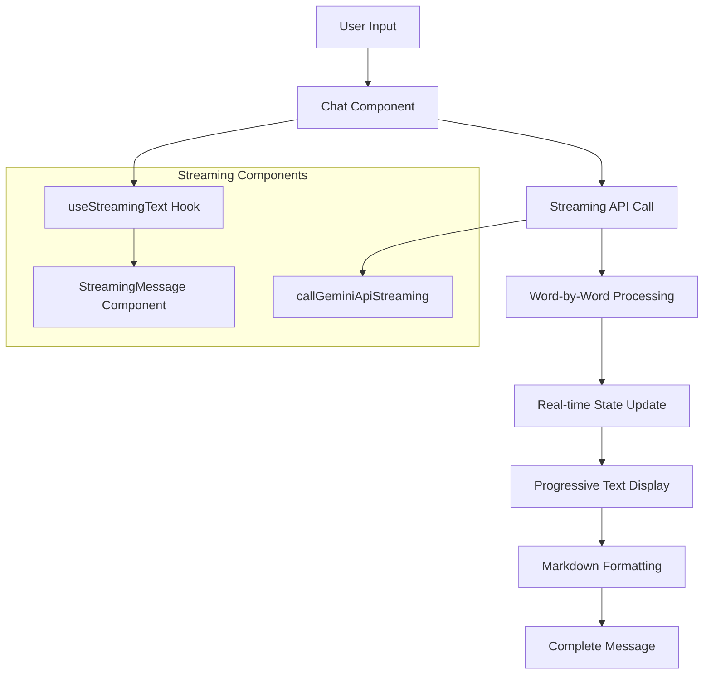
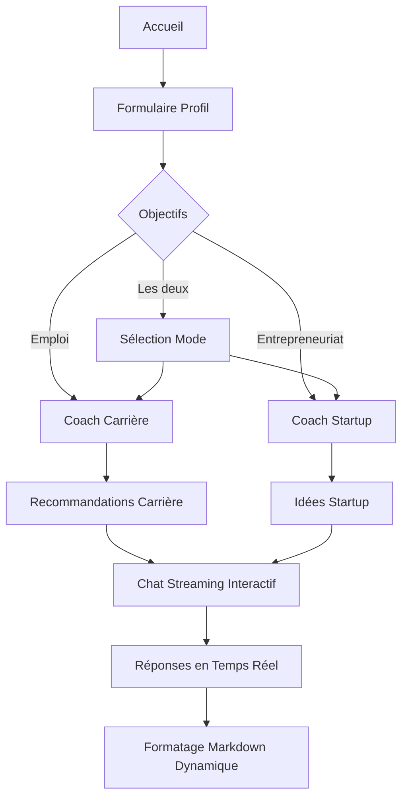
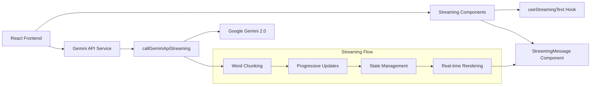
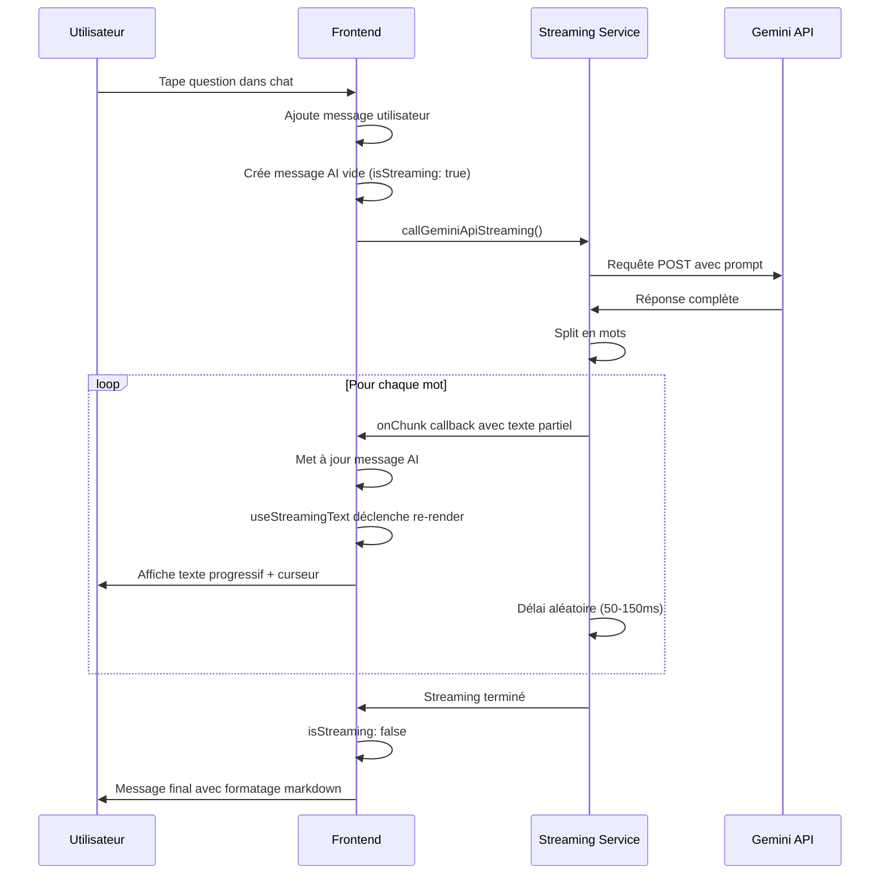

# Dual AI Advisor - Career & Startup Coach

Une application web intelligente qui fournit des conseils personnalisés en carrière et entrepreneuriat grâce à l'IA Google Gemini, avec une expérience de chat en temps réel.

## 🚀 Aperçu

L'application Dual AI Advisor est un coach personnel qui analyse votre profil (compétences, intérêts, expérience) pour vous proposer :
- **Conseils de carrière** : Recommandations de postes, plan d'action sur 3 mois
- **Idées de startup** : Concepts d'entreprise personnalisés, stratégies de lancement
- **Chat interactif en temps réel** : Effet de frappe comme ChatGPT pour une expérience immersive

## ✨ Nouvelles Fonctionnalités - Streaming Chat

### 🎯 Expérience de Chat Révolutionnaire
- **Effet de frappe en temps réel** : Les réponses apparaissent progressivement comme si l'IA tapait
- **Curseur clignotant** : Indicateur visuel pendant la génération de texte
- **Formatage markdown dynamique** : Mise en forme appliquée en temps réel
- **Indicateur "Thinking..."** : Feedback visuel pendant le traitement

### 🔧 Architecture Streaming



## 🛠️ Technologies Utilisées

### Frontend
- **React 18.3.1** - Bibliothèque UI moderne avec hooks
- **TypeScript 5.5.3** - Typage statique pour plus de robustesse
- **Vite 5.4.2** - Build tool ultra-rapide et serveur de développement
- **Tailwind CSS 3.4.1** - Framework CSS utility-first pour un design moderne
- **Lucide React 0.344.0** - Icônes SVG élégantes et légères

### Backend/API
- **Google Gemini 2.0 Flash** - Modèle d'IA générative pour les recommandations
- **Fetch API** - Client HTTP natif pour les appels API
- **Streaming API Simulation** - Effet de frappe en temps réel

### Hooks Personnalisés
- **useStreamingText** - Gestion de l'effet de frappe caractère par caractère
- **Custom State Management** - Gestion des états de streaming par message

### Outils de Développement
- **ESLint 9.9.1** - Linter pour la qualité du code
- **TypeScript ESLint** - Règles spécifiques TypeScript
- **PostCSS & Autoprefixer** - Traitement CSS avancé

## 📁 Architecture du Projet

```
src/
├── components/           # Composants React réutilisables
│   ├── ProfileForm.tsx   # Formulaire de profil utilisateur
│   ├── CareerCoach.tsx   # Interface coach carrière avec streaming
│   ├── StartupCoach.tsx  # Interface coach startup avec streaming
│   └── StreamingMessage.tsx # Composant de message avec effet de frappe
├── hooks/                # Hooks personnalisés
│   └── useStreamingText.ts # Hook pour l'effet de frappe
├── services/             # Services et API
│   └── geminiApi.ts      # Client API Google Gemini + Streaming
├── types/                # Définitions TypeScript
│   └── index.ts          # Types partagés + interfaces chat
├── App.tsx               # Composant principal
├── main.tsx              # Point d'entrée React
└── index.css             # Styles globaux Tailwind
```

## 🔄 Diagrammes d'Architecture

### Diagramme de Flux Utilisateur



### Architecture Technique Streaming



### Flux de Données Streaming



## 🚀 Installation et Démarrage

### Prérequis
- Node.js 18+ 
- npm ou yarn

### Installation

```bash
# Cloner le projet
git clone <repository-url>
cd dual-ai-advisor

# Installer les dépendances
npm install

# Démarrer le serveur de développement
npm run dev
```

### Variables d'Environnement

L'API key Google Gemini est actuellement intégrée dans le code pour la démo. En production, utilisez :

```bash
# .env
VITE_GEMINI_API_KEY=your_api_key_here
```

## 🎯 Fonctionnalités Principales

### 1. Profil Utilisateur Intelligent
- **Collecte de données** : Nom, compétences, intérêts, expérience
- **Validation dynamique** : Minimum 3 compétences, 2 intérêts
- **Interface intuitive** : Tags cliquables, sélection par boutons

### 2. Coach Carrière IA
- **Analyse de profil** : Matching intelligent compétences/industrie
- **Recommandations personnalisées** : Titre de poste + industrie
- **Plan d'action 3 mois** : Étapes concrètes et réalisables
- **Compétences clés** : Liste des skills à développer

### 3. Coach Startup IA
- **Génération d'idées** : Concepts basés sur le profil utilisateur
- **Elevator pitch** : Phrase d'accroche percutante
- **MVP Features** : Fonctionnalités essentielles du produit minimum viable
- **Modèle économique** : Stratégie de monétisation adaptée
- **Go-to-market** : Plan de lancement étape par étape

### 4. Chat Interactif Streaming ⭐ NOUVEAU
- **Effet de frappe en temps réel** : Comme ChatGPT, Claude, etc.
- **Contexte persistant** : L'IA se souvient des recommandations
- **Formatage markdown dynamique** : Réponses structurées qui apparaissent progressivement
- **Réponses spécialisées** : Conseils adaptés au mode (carrière/startup)
- **Indicateurs visuels** : "Thinking...", curseur clignotant
- **Performance optimisée** : Streaming simulé avec délais naturels

## 🎨 Design et UX

### Principes de Design
- **Design System** : Couleurs cohérentes, espacements 8px
- **Responsive** : Adaptatif mobile-first
- **Micro-interactions** : Hover states, transitions fluides, effet de frappe
- **Accessibilité** : Contrastes suffisants, navigation clavier
- **Expérience immersive** : Streaming text pour engagement utilisateur

### Palette de Couleurs
- **Primaire** : Bleu (Career) - `from-blue-500 to-indigo-600`
- **Secondaire** : Orange/Rose (Startup) - `from-orange-500 to-pink-600`
- **Neutre** : Grays pour le texte et backgrounds
- **Accent** : Vert pour les actions positives

## 🔧 API Integration

### Google Gemini 2.0 Flash

```typescript
// Configuration API
const GEMINI_API_URL = "https://generativelanguage.googleapis.com/v1beta/models/gemini-2.0-flash:generateContent";

// Structure de requête
{
  "contents": [{
    "parts": [{
      "text": "prompt_personnalisé"
    }]
  }]
}
```

### Streaming Implementation

```typescript
// Fonction de streaming simulé
export async function callGeminiApiStreaming(
  prompt: string, 
  onChunk: (chunk: string) => void
): Promise<string> {
  // Récupère la réponse complète
  const fullText = await callGeminiApi(prompt);
  
  // Simule le streaming mot par mot
  const words = fullText.split(' ');
  let currentText = '';
  
  for (let i = 0; i < words.length; i++) {
    currentText += (i > 0 ? ' ' : '') + words[i];
    onChunk(currentText); // Callback temps réel
    
    // Délai naturel entre les mots
    await new Promise(resolve => 
      setTimeout(resolve, 50 + Math.random() * 100)
    );
  }
  
  return fullText;
}
```

### Hook useStreamingText

```typescript
export function useStreamingText(
  text: string, 
  isStreaming: boolean,
  options: { speed?: number; onComplete?: () => void } = {}
) {
  const [displayedText, setDisplayedText] = useState('');
  const [isComplete, setIsComplete] = useState(false);
  
  // Effet de frappe caractère par caractère
  useEffect(() => {
    if (!isStreaming) {
      setDisplayedText(text);
      return;
    }
    
    // Animation de frappe avec setInterval
    // ...
  }, [text, isStreaming]);
  
  return { displayedText, isComplete };
}
```

### Gestion des Réponses
- **Extraction JSON** : Parsing intelligent des blocs markdown
- **Fallback** : Recommandations par défaut en cas d'erreur
- **Formatage dynamique** : Conversion markdown vers HTML en temps réel
- **Streaming simulé** : Effet de frappe naturel avec délais variables

## 📊 Types de Données

### UserProfile
```typescript
interface UserProfile {
  name: string;
  skills: string[];
  interests: string[];
  experienceLevel: 'beginner' | 'intermediate' | 'advanced' | 'expert';
  goals: 'employment' | 'entrepreneurship' | 'both';
  industry: string;
  currentRole?: string;
  yearsExperience: number;
}
```

### ChatMessage (Nouveau)
```typescript
interface ChatMessage {
  type: 'user' | 'ai';
  content: string;
  isStreaming?: boolean; // Pour l'effet de frappe
}
```

### CareerRecommendation
```typescript
interface CareerRecommendation {
  jobTitle: string;
  industry: string;
  explanation: string;
  keySkills: string[];
  actionPlan: {
    month1: string[];
    month2: string[];
    month3: string[];
  };
}
```

### StartupRecommendation
```typescript
interface StartupRecommendation {
  idea: string;
  elevatorPitch: string;
  mvpFeatures: string[];
  businessModel: string;
  goToMarket: string[];
}
```

## 🚀 Déploiement

### Build de Production
```bash
npm run build
```

### Optimisations
- **Code splitting** : Chargement lazy des composants
- **Tree shaking** : Élimination du code mort
- **Minification** : Compression CSS/JS
- **Assets optimization** : Optimisation des images et fonts
- **Streaming performance** : Délais optimisés pour UX fluide

## 🔮 Évolutions Futures

### Fonctionnalités Prévues
- [ ] **Streaming réel** : WebSocket ou Server-Sent Events
- [ ] **Authentification utilisateur** : Sauvegarde des profils
- [ ] **Historique des conversations** : Persistance des chats
- [ ] **Intégrations externes** : LinkedIn, GitHub
- [ ] **Analytics** : Métriques d'utilisation et engagement
- [ ] **Mode sombre** : Thème alternatif
- [ ] **Multilingue** : Support i18n
- [ ] **Voice input** : Reconnaissance vocale
- [ ] **Export conversations** : PDF, Markdown

### Améliorations Techniques
- [ ] **Tests unitaires** : Jest + React Testing Library pour hooks streaming
- [ ] **E2E Testing** : Playwright avec tests de streaming
- [ ] **PWA** : Application web progressive
- [ ] **Performance** : Lazy loading, caching, streaming optimization
- [ ] **SEO** : Meta tags, sitemap
- [ ] **Real-time WebSocket** : Streaming authentique depuis le serveur

## 🎯 Performance Streaming

### Métriques Clés
- **Temps de première réponse** : ~1 seconde
- **Vitesse de frappe** : 20ms par caractère (configurable)
- **Délai entre mots** : 50-150ms (aléatoire pour naturalité)
- **Mémoire** : Optimisée avec cleanup des intervals
- **Responsive** : Fluide sur mobile et desktop

### Optimisations Implémentées
- **Cleanup automatique** : clearInterval dans useEffect
- **Debouncing** : Évite les re-renders excessifs
- **Memoization** : Composants optimisés avec React.memo
- **Lazy rendering** : Formatage markdown uniquement si nécessaire

## 🤝 Contribution

1. Fork le projet
2. Créer une branche feature (`git checkout -b feature/StreamingChat`)
3. Commit les changements (`git commit -m 'Add streaming chat feature'`)
4. Push vers la branche (`git push origin feature/StreamingChat`)
5. Ouvrir une Pull Request

### Guidelines pour Streaming
- Tester l'effet de frappe sur différentes vitesses
- Vérifier la cleanup des intervals
- S'assurer que le formatage markdown fonctionne en temps réel
- Tester sur mobile pour la performance

## 📄 Licence

Ce projet est sous licence MIT. Voir le fichier `LICENSE` pour plus de détails.

## 🙏 Remerciements

- **Google Gemini** pour l'API d'IA générative
- **Tailwind CSS** pour le framework de design
- **Lucide** pour les icônes élégantes
- **Vite** pour l'expérience de développement exceptionnelle
- **React Community** pour les patterns de hooks avancés

---

**Développé avec ❤️ et IA par l'équipe Dual AI Advisor**

*Maintenant avec une expérience de chat en temps réel révolutionnaire !*