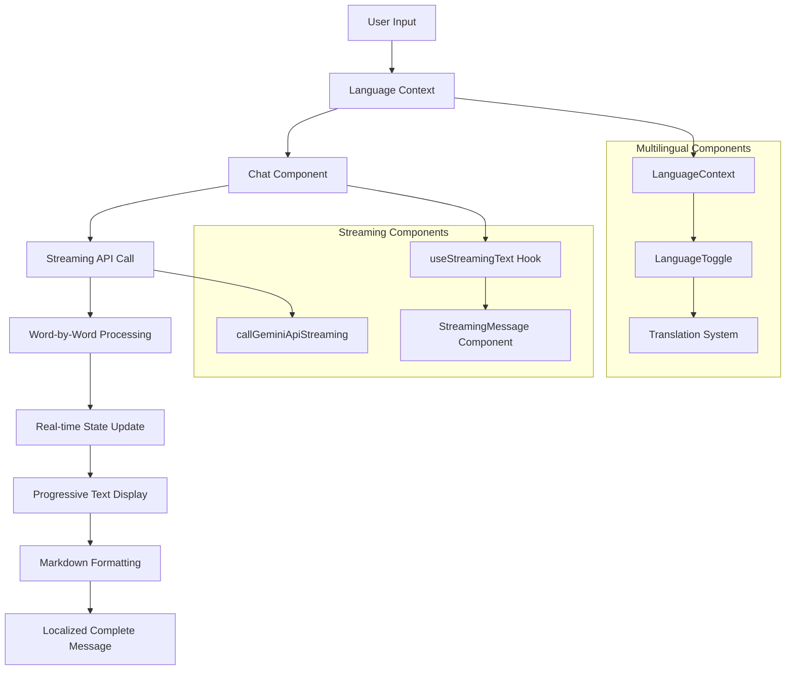
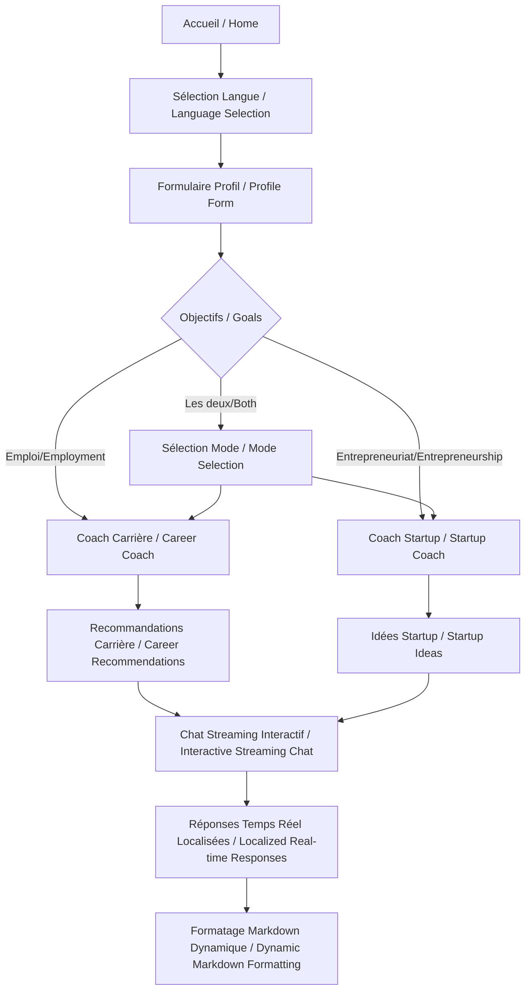
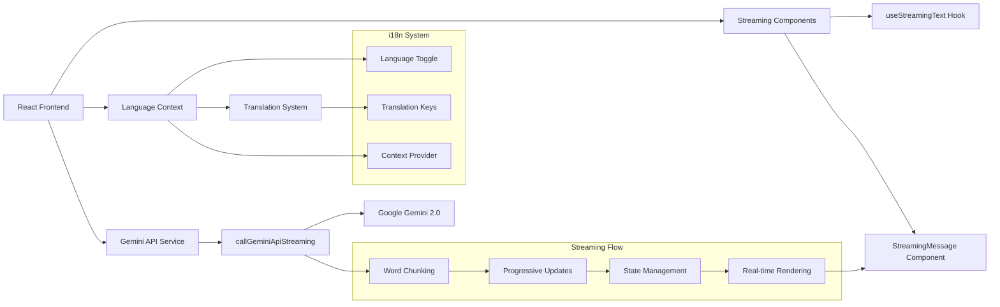

# Dual AI Advisor - Career & Startup Coach 🌍

Une application web intelligente multilingue (Français/Anglais) qui fournit des conseils personnalisés en carrière et entrepreneuriat grâce à l'IA Google Gemini, avec une expérience de chat en temps réel.

*An intelligent multilingual web application (French/English) that provides personalized career and entrepreneurship advice using Google Gemini AI, with a real-time chat experience.*

## 🚀 Aperçu / Overview

L'application Dual AI Advisor est un coach personnel qui analyse votre profil (compétences, intérêts, expérience) pour vous proposer :

*The Dual AI Advisor application is a personal coach that analyzes your profile (skills, interests, experience) to offer you:*

- **Conseils de carrière / Career advice** : Recommandations de postes, plan d'action sur 3 mois
- **Idées de startup / Startup ideas** : Concepts d'entreprise personnalisés, stratégies de lancement
- **Chat interactif en temps réel / Real-time interactive chat** : Effet de frappe comme ChatGPT pour une expérience immersive
- **Support multilingue / Multilingual support** : Interface complète en français et anglais

## ✨ Nouvelles Fonctionnalités - New Features

### 🌍 **Support Multilingue Complet / Complete Multilingual Support**
- **Interface bilingue** : Français et anglais avec basculement instantané
- **Traductions contextuelles** : Tous les textes, messages et interfaces traduits
- **Persistance de langue** : Mémorisation du choix de langue utilisateur
- **Localisation intelligente** : Adaptation culturelle des contenus

### 🎯 **Expérience de Chat Révolutionnaire / Revolutionary Chat Experience**
- **Effet de frappe en temps réel** : Les réponses apparaissent progressivement comme si l'IA tapait
- **Curseur clignotant** : Indicateur visuel pendant la génération de texte
- **Formatage markdown dynamique** : Mise en forme appliquée en temps réel
- **Indicateur "Thinking..."** : Feedback visuel pendant le traitement

### 🔧 Architecture Streaming & i18n



## 🛠️ Technologies Utilisées / Technologies Used

### Frontend
- **React 18.3.1** - Bibliothèque UI moderne avec hooks / Modern UI library with hooks
- **TypeScript 5.5.3** - Typage statique pour plus de robustesse / Static typing for robustness
- **Vite 5.4.2** - Build tool ultra-rapide et serveur de développement / Ultra-fast build tool and dev server
- **Tailwind CSS 3.4.1** - Framework CSS utility-first pour un design moderne / Utility-first CSS framework
- **Lucide React 0.344.0** - Icônes SVG élégantes et légères / Elegant and lightweight SVG icons

### Internationalisation / Internationalization
- **React Context API** - Gestion d'état global pour la langue / Global state management for language
- **Custom i18n System** - Système de traduction personnalisé / Custom translation system
- **Dynamic Language Switching** - Basculement de langue en temps réel / Real-time language switching

### Backend/API
- **Google Gemini 2.0 Flash** - Modèle d'IA générative pour les recommandations / Generative AI model for recommendations
- **Fetch API** - Client HTTP natif pour les appels API / Native HTTP client for API calls
- **Streaming API Simulation** - Effet de frappe en temps réel / Real-time typing effect

### Hooks Personnalisés / Custom Hooks
- **useLanguage** - Gestion du contexte multilingue / Multilingual context management
- **useStreamingText** - Gestion de l'effet de frappe caractère par caractère / Character-by-character typing effect
- **Custom State Management** - Gestion des états de streaming par message / Streaming state management per message

## 📁 Architecture du Projet / Project Architecture

```
src/
├── components/           # Composants React réutilisables / Reusable React components
│   ├── ProfileForm.tsx   # Formulaire de profil utilisateur (multilingue)
│   ├── CareerCoach.tsx   # Interface coach carrière avec streaming (multilingue)
│   ├── StartupCoach.tsx  # Interface coach startup avec streaming (multilingue)
│   ├── StreamingMessage.tsx # Composant de message avec effet de frappe
│   └── LanguageToggle.tsx   # Bouton de basculement de langue
├── contexts/             # Contextes React / React Contexts
│   └── LanguageContext.tsx  # Contexte multilingue avec traductions
├── hooks/                # Hooks personnalisés / Custom hooks
│   └── useStreamingText.ts # Hook pour l'effet de frappe
├── services/             # Services et API
│   └── geminiApi.ts      # Client API Google Gemini + Streaming
├── types/                # Définitions TypeScript
│   └── index.ts          # Types partagés + interfaces chat
├── App.tsx               # Composant principal avec support multilingue
├── main.tsx              # Point d'entrée React
└── index.css             # Styles globaux Tailwind
```

## 🌍 Système de Traduction / Translation System

### Structure des Traductions / Translation Structure

```typescript
const translations = {
  fr: {
    'header.title': 'AI Advisor',
    'header.subtitle': 'Votre Coach Personnel Carrière & Startup',
    'profile.title': 'Créez Votre Profil',
    'career.title': 'Coach Carrière',
    'startup.title': 'Coach Startup',
    // ... 100+ clés de traduction
  },
  en: {
    'header.title': 'AI Advisor',
    'header.subtitle': 'Your Personal Career & Startup Coach',
    'profile.title': 'Create Your Profile',
    'career.title': 'Career Coach',
    'startup.title': 'Startup Coach',
    // ... 100+ translation keys
  }
};
```

### Hook useLanguage

```typescript
const { language, setLanguage, t } = useLanguage();

// Utilisation / Usage
const title = t('profile.title'); // "Créez Votre Profil" ou "Create Your Profile"
const welcomeMsg = t('welcome.title').replace('{name}', userName);
```

### Composant LanguageToggle

```typescript
// Basculement instantané entre FR/EN
// Instant switching between FR/EN
<LanguageToggle />
```

## 🔄 Diagrammes d'Architecture / Architecture Diagrams

### Diagramme de Flux Utilisateur Multilingue / Multilingual User Flow Diagram



### Architecture Technique Multilingue / Multilingual Technical Architecture



## 🚀 Installation et Démarrage / Installation and Setup

### Prérequis / Prerequisites
- Node.js 18+ 
- npm ou yarn / npm or yarn

### Installation

```bash
# Cloner le projet / Clone the project
git clone <repository-url>
cd dual-ai-advisor

# Installer les dépendances / Install dependencies
npm install

# Démarrer le serveur de développement / Start development server
npm run dev
```

### Variables d'Environnement / Environment Variables

L'API key Google Gemini est actuellement intégrée dans le code pour la démo. En production, utilisez :

*The Google Gemini API key is currently integrated in the code for demo. In production, use:*

```bash
# .env
VITE_GEMINI_API_KEY=your_api_key_here
```

## 🎯 Fonctionnalités Principales / Main Features

### 1. Interface Multilingue Complète / Complete Multilingual Interface
- **Basculement instantané** : FR ↔ EN en un clic / Instant switching: FR ↔ EN with one click
- **Traduction contextuelle** : Tous les éléments UI traduits / Contextual translation: All UI elements translated
- **Persistance** : Mémorisation du choix utilisateur / Persistence: User choice memorization
- **Localisation** : Adaptation culturelle des contenus / Localization: Cultural content adaptation

### 2. Profil Utilisateur Intelligent Multilingue / Multilingual Intelligent User Profile
- **Collecte de données localisée** : Formulaires adaptés à la langue / Localized data collection: Language-adapted forms
- **Validation dynamique** : Messages d'erreur traduits / Dynamic validation: Translated error messages
- **Interface intuitive** : Labels et placeholders localisés / Intuitive interface: Localized labels and placeholders

### 3. Coach Carrière IA Multilingue / Multilingual AI Career Coach
- **Analyse de profil** : Matching intelligent compétences/industrie / Profile analysis: Intelligent skills/industry matching
- **Recommandations personnalisées** : Contenu adapté à la langue / Personalized recommendations: Language-adapted content
- **Plan d'action 3 mois** : Étapes concrètes et localisées / 3-month action plan: Concrete and localized steps
- **Chat interactif** : Conseils en temps réel dans la langue choisie / Interactive chat: Real-time advice in chosen language

### 4. Coach Startup IA Multilingue / Multilingual AI Startup Coach
- **Génération d'idées** : Concepts adaptés au marché local / Idea generation: Concepts adapted to local market
- **Elevator pitch** : Phrases d'accroche culturellement adaptées / Elevator pitch: Culturally adapted hooks
- **Stratégies localisées** : Plans de lancement adaptés au contexte / Localized strategies: Context-adapted launch plans

### 5. Chat Interactif Streaming Multilingue ⭐ NOUVEAU / NEW
- **Effet de frappe multilingue** : Streaming naturel dans les deux langues / Multilingual typing effect: Natural streaming in both languages
- **Réponses contextuelles** : L'IA répond dans la langue de l'interface / Contextual responses: AI responds in interface language
- **Formatage dynamique** : Markdown adapté aux conventions linguistiques / Dynamic formatting: Markdown adapted to linguistic conventions
- **Indicateurs localisés** : "Réflexion..." / "Thinking..." selon la langue / Localized indicators: "Réflexion..." / "Thinking..." based on language

## 🎨 Design et UX Multilingue / Multilingual Design and UX

### Principes de Design Internationalisé / Internationalized Design Principles
- **Flexibilité textuelle** : Layouts adaptatifs aux longueurs de texte variables / Text flexibility: Adaptive layouts for variable text lengths
- **Iconographie universelle** : Symboles compréhensibles dans toutes les cultures / Universal iconography: Symbols understandable in all cultures
- **Couleurs culturellement neutres** : Palette respectueuse des différences culturelles / Culturally neutral colors: Palette respectful of cultural differences
- **Typographie multilingue** : Polices supportant les caractères spéciaux / Multilingual typography: Fonts supporting special characters

### Composant LanguageToggle Design

```typescript
// Design élégant avec icône globe et indicateur de langue
// Elegant design with globe icon and language indicator
<button className="flex items-center px-3 py-2 text-gray-600 hover:text-gray-900 transition-colors rounded-lg hover:bg-gray-100">
  <Globe className="w-4 h-4 mr-2" />
  <span className="font-medium text-sm">
    {language === 'fr' ? 'EN' : 'FR'}
  </span>
</button>
```

## 🔧 API Integration Multilingue / Multilingual API Integration

### Prompts Contextuels par Langue / Contextual Prompts by Language

```typescript
// Les prompts s'adaptent automatiquement à la langue de l'interface
// Prompts automatically adapt to interface language
const generateLocalizedPrompt = (userProfile, language) => {
  const contextualPrompt = language === 'fr' 
    ? `En tant qu'expert en conseil de carrière francophone...`
    : `As an expert career advisor...`;
  
  return contextualPrompt + userProfile;
};
```

### Streaming Multilingue / Multilingual Streaming

```typescript
// Le streaming respecte les conventions linguistiques
// Streaming respects linguistic conventions
export async function generateFollowUpResponseStreaming(
  question: string, 
  context: string, 
  mode: 'career' | 'startup',
  language: 'fr' | 'en',
  onChunk: (chunk: string) => void
): Promise<string> {
  const localizedPrompt = buildLocalizedPrompt(question, context, mode, language);
  return await callGeminiApiStreaming(localizedPrompt, onChunk);
}
```

## 📊 Types de Données Multilingues / Multilingual Data Types

### LanguageContext
```typescript
interface LanguageContextType {
  language: Language;
  setLanguage: (lang: Language) => void;
  t: (key: string) => string; // Fonction de traduction / Translation function
}

type Language = 'fr' | 'en';
```

### Traductions Structurées / Structured Translations
```typescript
interface Translations {
  [language: string]: {
    [key: string]: string;
  };
}

// Plus de 100 clés de traduction organisées par sections
// Over 100 translation keys organized by sections
const translations: Translations = {
  fr: { /* traductions françaises */ },
  en: { /* english translations */ }
};
```

## 🚀 Déploiement Multilingue / Multilingual Deployment

### Build de Production / Production Build
```bash
npm run build
```

### Optimisations i18n / i18n Optimizations
- **Tree shaking des traductions** : Seules les traductions utilisées sont incluses / Translation tree shaking: Only used translations included
- **Lazy loading linguistique** : Chargement à la demande des langues / Linguistic lazy loading: On-demand language loading
- **Cache des traductions** : Mise en cache pour performance / Translation cache: Caching for performance
- **SEO multilingue** : Meta tags adaptés à chaque langue / Multilingual SEO: Meta tags adapted to each language

## 🔮 Évolutions Futures / Future Developments

### Fonctionnalités Prévues / Planned Features
- [ ] **Détection automatique de langue** : Basée sur la géolocalisation / Automatic language detection: Based on geolocation
- [ ] **Plus de langues** : Espagnol, allemand, italien / More languages: Spanish, German, Italian
- [ ] **Traduction temps réel** : Traduction automatique des réponses IA / Real-time translation: Automatic AI response translation
- [ ] **Localisation culturelle** : Adaptation des conseils aux marchés locaux / Cultural localization: Advice adaptation to local markets
- [ ] **Voice input multilingue** : Reconnaissance vocale dans plusieurs langues / Multilingual voice input: Voice recognition in multiple languages
- [ ] **Export localisé** : Documents dans la langue choisie / Localized export: Documents in chosen language

### Améliorations Techniques i18n / i18n Technical Improvements
- [ ] **ICU MessageFormat** : Formatage avancé des messages / Advanced message formatting
- [ ] **Pluralisation intelligente** : Règles de pluriel par langue / Intelligent pluralization: Plural rules by language
- [ ] **RTL Support** : Support des langues droite-à-gauche / Right-to-left language support
- [ ] **Formatage des dates/nombres** : Selon les conventions locales / Date/number formatting: According to local conventions

## 🎯 Performance Multilingue / Multilingual Performance

### Métriques Clés / Key Metrics
- **Temps de basculement de langue** : < 100ms / Language switching time: < 100ms
- **Taille du bundle i18n** : +15KB pour le support multilingue / i18n bundle size: +15KB for multilingual support
- **Streaming multilingue** : Performance identique dans toutes les langues / Multilingual streaming: Identical performance in all languages
- **Mémoire** : Optimisée avec cleanup des traductions non utilisées / Memory: Optimized with unused translation cleanup

### Optimisations Implémentées / Implemented Optimizations
- **Context memoization** : Évite les re-renders inutiles / Avoids unnecessary re-renders
- **Translation caching** : Cache des traductions fréquemment utilisées / Frequently used translation cache
- **Lazy translation loading** : Chargement à la demande / On-demand loading
- **Bundle splitting** : Séparation des langues pour optimiser le chargement / Language separation for optimized loading

## 🤝 Contribution Multilingue / Multilingual Contribution

### Guidelines pour i18n / i18n Guidelines
1. **Ajouter de nouvelles traductions** : Suivre la structure de clés existante / Add new translations: Follow existing key structure
2. **Tester dans les deux langues** : Vérifier l'affichage FR et EN / Test in both languages: Check FR and EN display
3. **Respecter les conventions culturelles** : Adapter le contenu au contexte / Respect cultural conventions: Adapt content to context
4. **Valider les longueurs de texte** : S'assurer que l'UI s'adapte / Validate text lengths: Ensure UI adapts

### Processus de Traduction / Translation Process
1. Identifier les nouveaux textes à traduire / Identify new texts to translate
2. Ajouter les clés dans `LanguageContext.tsx` / Add keys in `LanguageContext.tsx`
3. Utiliser `t('key')` dans les composants / Use `t('key')` in components
4. Tester l'affichage dans les deux langues / Test display in both languages
5. Valider la cohérence terminologique / Validate terminological consistency

## 📄 Licence / License

Ce projet est sous licence MIT. Voir le fichier `LICENSE` pour plus de détails.

*This project is under MIT license. See the `LICENSE` file for more details.*

## 🙏 Remerciements / Acknowledgments

- **Google Gemini** pour l'API d'IA générative / for the generative AI API
- **Tailwind CSS** pour le framework de design / for the design framework
- **Lucide** pour les icônes élégantes / for elegant icons
- **Vite** pour l'expérience de développement exceptionnelle / for exceptional development experience
- **React Community** pour les patterns de hooks avancés / for advanced hook patterns
- **i18n Community** pour les meilleures pratiques d'internationalisation / for internationalization best practices

---

**Développé avec ❤️ et IA par l'équipe Dual AI Advisor**

*Developed with ❤️ and AI by the Dual AI Advisor team*

**Maintenant avec une expérience multilingue complète et un chat en temps réel révolutionnaire !**

*Now with complete multilingual experience and revolutionary real-time chat!*

🌍 **Français** | **English** | **Español** (bientôt/coming soon) | **Deutsch** (bientôt/coming soon)